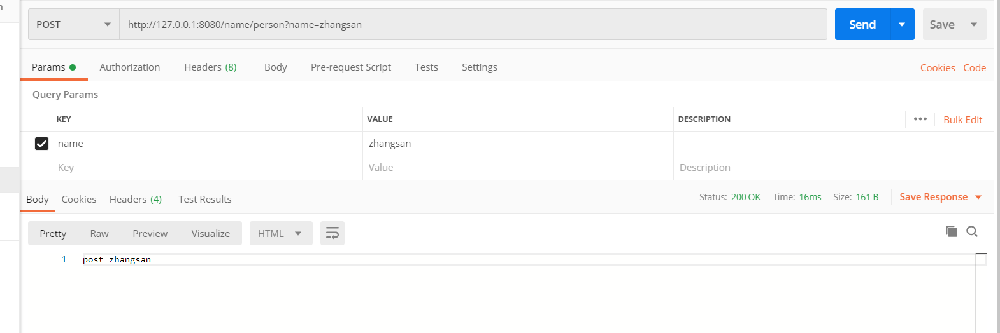

# Sdring

spring of dyzcs

#### 运行项目

1. 从github导入本地IDEA
2. 运行test下com.deng.sdring.Application
3. 浏览器打开[http://127.0.0.1:8080/name/person?name=%E5%BC%A0%E4%B8%89&age=18](http://127.0.0.1:8080/name/person?name=张三&age=18)

4. 使用postman测试post

    

    